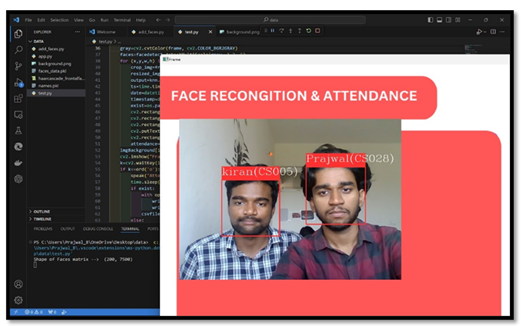
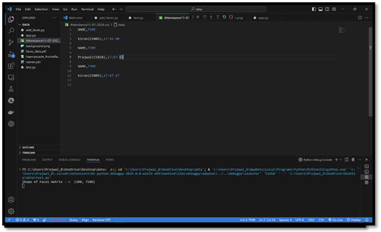

# 🎓 Attendance Marking System Using Image Processing

> Mini Project submitted to  
**GOVERNMENT OF KARNATAKA**  
**Government Engineering College, Talakal, Koppal-583238**  
Under Visvesvaraya Technological University, Belagavi  
**B.E. 6th Semester, Computer Science & Engineering**  

---

## ✅ Project Overview

This mini project titled **“Attendance Marking System Using Image Processing”** is designed to automate the student attendance process by utilizing facial recognition. The system captures the face of a student through a webcam, processes it using image recognition algorithms, and then marks the attendance in a `.csv` file along with the timestamp. It also gives **voice feedback** for real-time interaction and confirmation.

This project was successfully completed as part of the academic curriculum for the partial fulfillment of the Bachelor’s Degree in Computer Science and Engineering under VTU, Belagavi.

---

## 📌 Key Features

- 🎯 Face detection and recognition using OpenCV and machine learning
- 📸 Real-time image capture and recognition using webcam
- 🕒 Timestamped attendance entries
- 📁 Attendance saved in CSV format
- 🗣️ Voice interaction feedback for marked attendance
- 🧠 Model training from student face datasets
- 🔒 Duplicate entry prevention for the same session

---

## 🛠️ Technologies Used

| Technology     | Purpose                                      |
|----------------|----------------------------------------------|
| Python         | Core programming language                    |
| OpenCV         | Face detection and image capture             |
| Scikit-learn   | Face recognition and model training          |
| Pillow (PIL)   | Image preprocessing                          |
| pywin32        | Text-to-Speech using Windows voice API       |
| CSV            | Attendance data storage                      |

---
<h2>📸 Project Snapshots</h2>

  

    <h4>👁️ Face Detection and Recognition (Live Feed)</h4>
    
  

  

    <h4>📁 Attendance CSV Log Output</h4>
    
  

<strong>Note:</strong> Upload your images to a folder named <code>images/</code> in your GitHub repository and make sure the file names match.

## 🚀 Getting Started

###🔧 Step 1: Clone the Repository

### 📦 Step 2: Install Dependencies
Make sure Python is installed, then run:
pip install -r requirements.txt

### 🧠 Step 3: Prepare Dataset & Train the Model
Create a folder named dataset/.

Inside it, add one subfolder for each student, named by their ID or name.

Each subfolder should contain several images of that student's face.

python train_model.py

### 🎯 Step 4: Run Attendance Recognition
To launch the live webcam and start marking attendance:

bash
Copy
Edit
python detect_and_mark.py

### 🧪 Sample Output
csv
Copy
Edit
Name,Date,Time
Kiran Shetty,2025-06-07,10:15:23
Ayesha Patil,2025-06-07,10:17:12

## 👨‍💻 Authors

- **B. Kiran**  

## 📜 License

This project is intended strictly for **academic and educational purposes only**.  
© 2025 Government Engineering College, Talakal, Karnataka. All rights reserved.

---

## 🙌 Acknowledgements

- **Faculty Guide:** Tejaswini Eshwar Achar
- **Department:** Computer Science and Engineering  
- **Institution:** VTU University, Belagavi

Special thanks to all teammates, friends, and faculty members who contributed to the successful completion of this project.

